# Interactive 2D Solar System 🌌

A simple, interactive 2D solar system simulation built with C++ and OpenGL/GLUT. This project was created as a group submission for a Computer Graphics course.

---

## 📜 Description

This project provides a top-down 2D visualization of our solar system. It is an educational and interactive tool that allows users to explore the planets, control the flow of time, and navigate the scene with a flexible camera. The goal was to apply fundamental computer graphics concepts to create a dynamic and engaging simulation.

---

## 📸 Screenshots of the Project

**Scenario 1: Full view of the solar system**
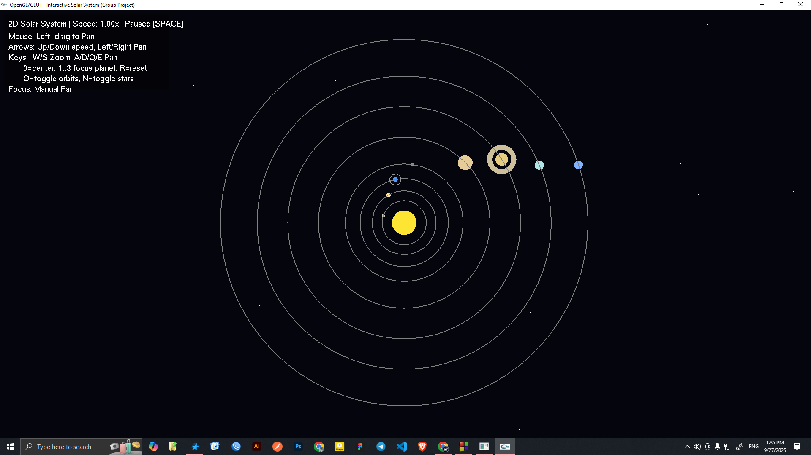

**Scenario 2: Zoomed out view with stars**
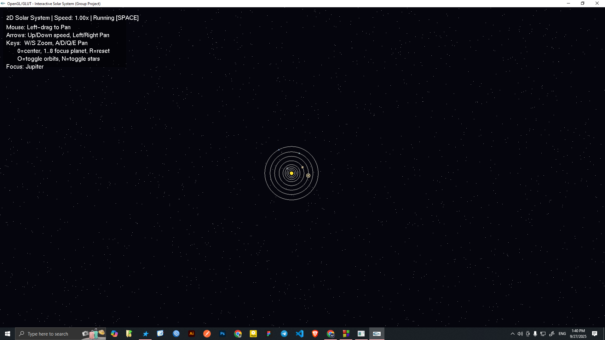

**Scenario 3: Zoomed-in view of Sun**
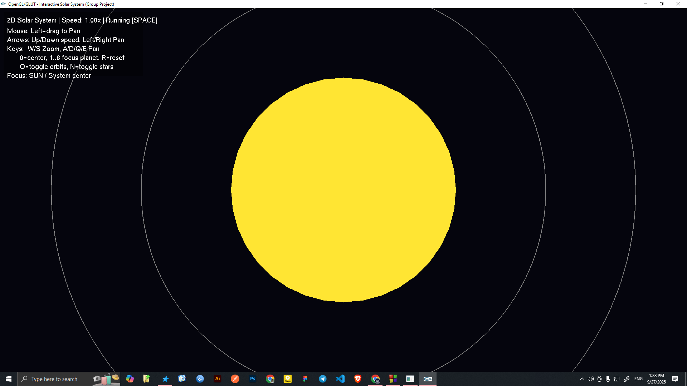

**Scenario 4: Zoomed-in view of Mercury**
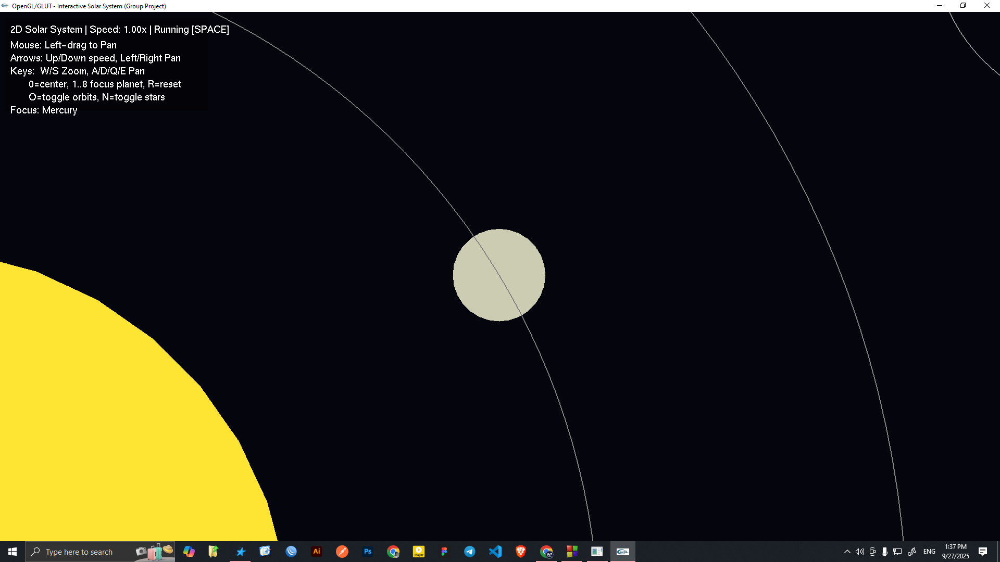

**Scenario 5: Zoomed-in view of Venus**
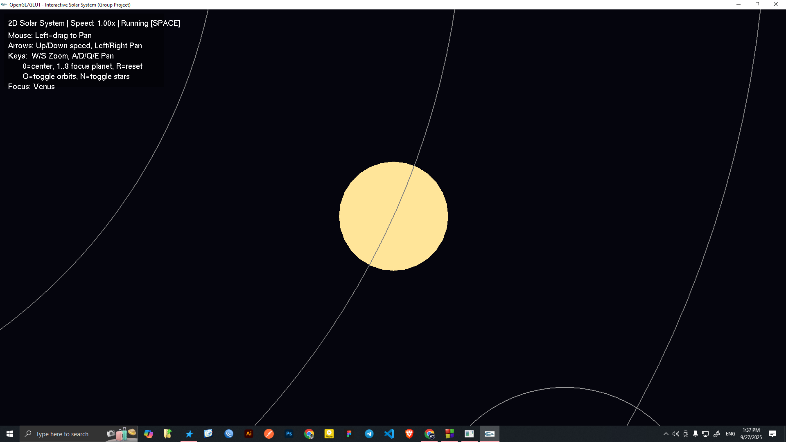

**Scenario 6: Zoomed-in view of Earth with orbiting Moon**
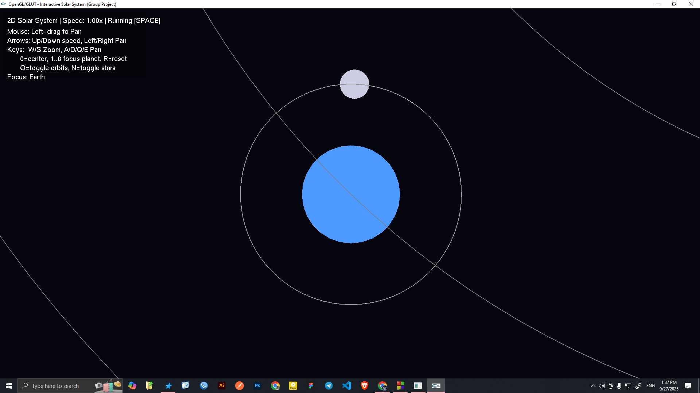

**Scenario 7: Zoomed-in view of Mars**
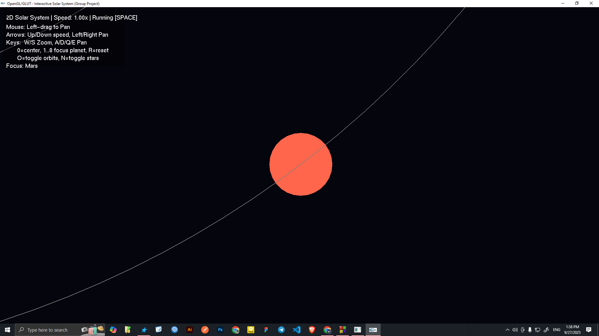

**Scenario 8: Zoomed-in view of Jupiter**
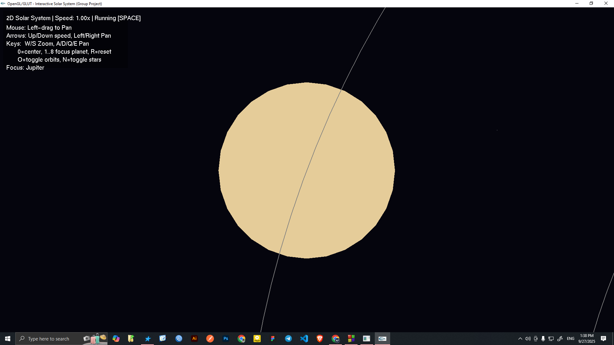

**Scenario 9: Zoomed-in view of Saturn**
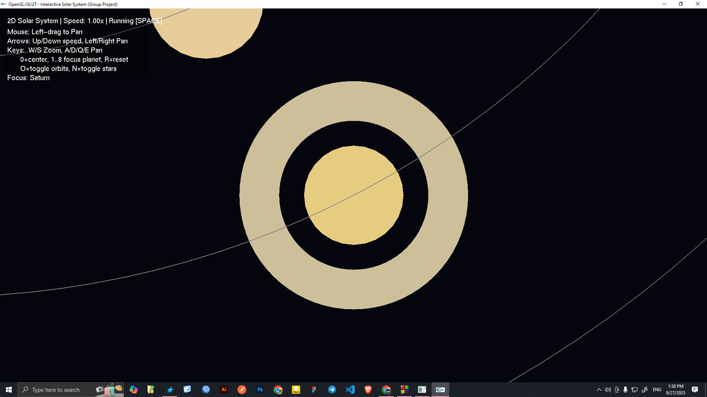

**Scenario 10: Zoomed-in view of Uranus**
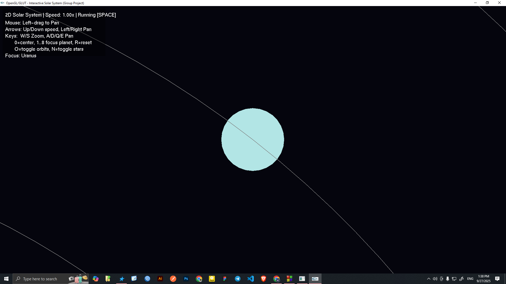

**Scenario 11: Zoomed-in view of Neptune**
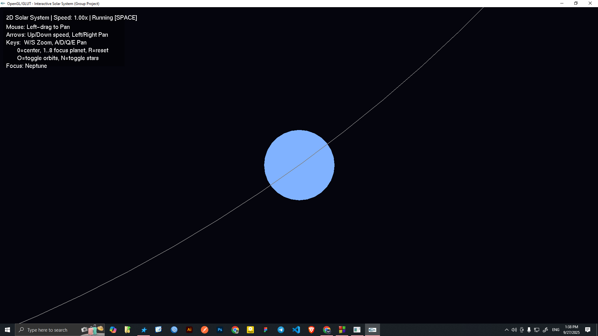

---

## ✨ Features

* **2D Visualization:** A clear and intuitive top-down view of the Sun and all eight planets.
* **Real-time Animation:** Planets orbit the Sun at their relative speeds, and the Earth's moon orbits the Earth.
* **Interactive Camera:**
    * **Pan:** Move the view using the mouse (left-click and drag) or keyboard (A/D/Q/E and Arrow Keys).
    * **Zoom:** Zoom in and out using the mouse wheel or W/S keys.
* **Simulation Controls:**
    * **Pause/Play:** Freeze time by pressing the Spacebar.
    * **Speed Control:** Speed up or slow down time with the Up/Down Arrow keys.
* **Focus-Locking:** Lock the camera onto the Sun (`0` key) or any planet (`1`-`8` keys).
* **Toggleable Elements:** Turn the visibility of planetary orbits (`O` key) and the background starfield (`N` key) on or off.
* **Informative HUD:** An on-screen display shows controls, simulation status, and current camera focus.
* **Reset Functionality:** Press the `R` key to reset the view and simulation to its initial state.

---

## 🛠️ Technologies Used

* **Language:** C++
* **Graphics API:** OpenGL
* **Utility Toolkit:** GLUT (OpenGL Utility Toolkit) for windowing and input handling.
* **IDE:** Code::Blocks with MinGW GCC Compiler

---

## 🚀 Getting Started

Follow these instructions to get a copy of the project up and running on your local machine.

### Prerequisites

You will need a C++ development environment. This project was built using **Code::Blocks** with the **MinGW GCC compiler** on Windows.

You must also have the **GLUT** library set up.
1.  Download the GLUT library files (`glut.h`, `glut32.lib`, `glut32.dll`).
2.  Place `glut.h` in your MinGW include folder (e.g., `C:\Program Files (x86)\CodeBlocks\MinGW\include\GL`).
3.  Place `glut32.lib` in your MinGW lib folder (e.g., `C:\Program Files (x86)\CodeBlocks\MinGW\lib`).
4.  Place `glut32.dll` in a system path folder (e.g., `C:\Windows\System32`).

### Installation

1.  **Clone the repository:**
    ```sh
    git clone [https://github.com/fuadhasandipro/InteractiveSolarSystem.git](https://github.com/fuadhasandipro/InteractiveSolarSystem.git)
    ```
2.  **Open the Project:**
    Navigate to the project directory and open the `InteractiveSolarSystem.cbp` file with Code::Blocks.
3.  **Build and Run:**
    The project linker settings should already be configured to link against `glut32`, `opengl32`, and `glu32`. Simply click "Build and Run" (F9) in Code::Blocks to compile and start the simulation.

---

## ⌨️ How to Use: Controls

| Key(s) | Action |
| --- | --- |
| `W` / `S` / Mouse Wheel | Zoom In / Zoom Out |
| `A` / `D` / `←` / `→` | Pan Camera Left / Right |
| `Q` / `E` | Pan Camera Down / Up (Vertical Pan) |
| Left Mouse Drag | Pan Camera Freely |
| `↑` / `↓` | Increase / Decrease Simulation Speed |
| `Spacebar` | Pause / Resume Simulation |
| `0` - `8` | Focus Camera on Sun (0) or Planets (1-8) |
| `O` | Toggle Visibility of Planetary Orbits |
| `N` | Toggle Visibility of the Starfield Background |
| `R` | Reset View and Simulation |
| `ESC` | Exit the Application |

---

## 📂 Project Structure

The project is organized into several logical components:

* `main.cpp`: The main entry point. Initializes GLUT and sets up the window and callbacks.
* `render.cpp`: Handles the core rendering loop and OpenGL projection setup.
* `camera.cpp`: Manages all user input (keyboard/mouse) and the HUD.
* `planets.cpp`: Contains the data and logic for animating and drawing the Sun, planets, and moons.
* `stars.cpp`: Responsible for generating and drawing the starfield background.
* `common.h`: A shared header file containing common data structures (`Planet`, `Star`) and global variables.

---

## 👥 Authors / Group Members

This project was a collaborative effort by:

* FUAD HASAN - 23-51947-2
* MD MAHRAB HASAN CHOWDHURY - 21-45877-3
* ANIS MAHMUD RATUL - 23-51922-2
* SHAFAYAT KHAN SHAAN - 23-52134-2
